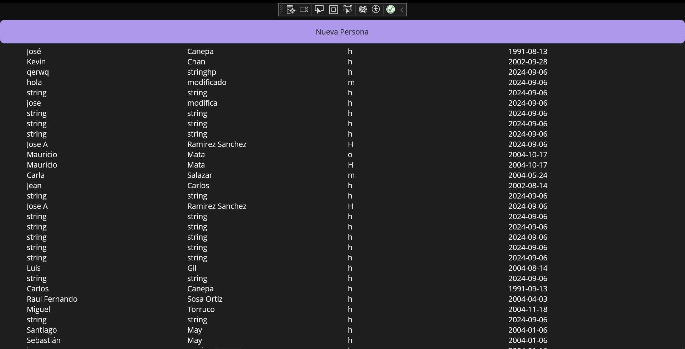
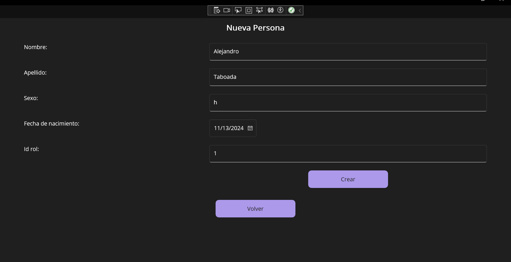

### Description
A cross-platform MAUI application that performs basic CRUD operations with an external API and displays the results on screen.
The app uses of data binding to update the views efficiently and mantain a clean and organized code.

### Features

- **GET Operation:** Retrieves data from the external API and displays it on a scrollable table.
  
-  **POST Operation**: Provides a form to add new person entries.
  
